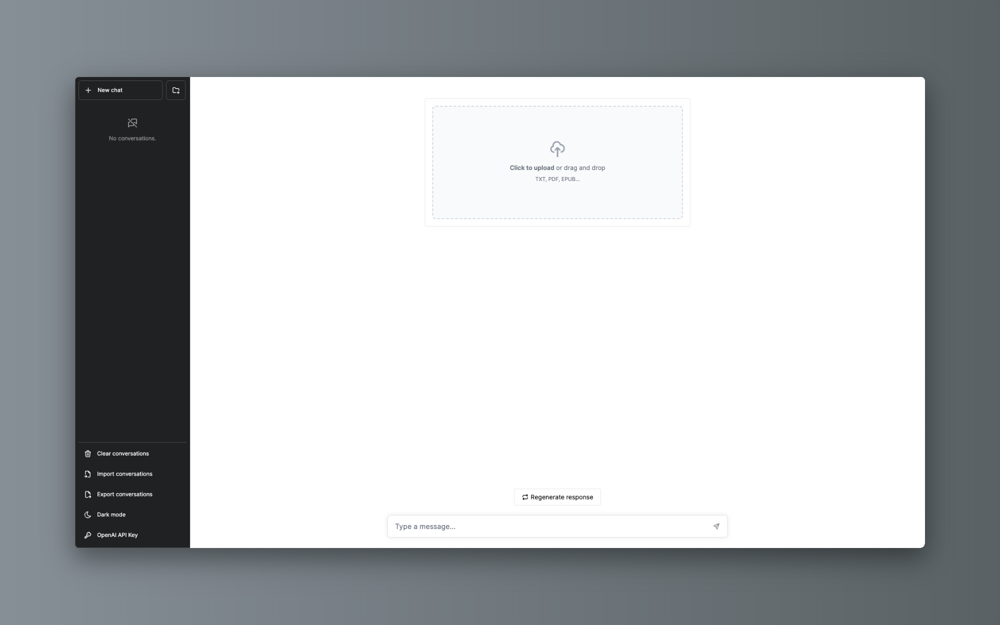

# Chatglm和LLama-index

EN | [中文文档](README.zh.md)

> this repository use [jerryjliu/llama_index](https://github.com/jerryjliu/llama_index), based on [mckaywrigley/chatbot-ui](https://github.com/mckaywrigley/chatbot-ui), inspired by [madawei2699/myGPTReader](https://github.com/madawei2699/myGPTReader)



**Upload your file and have a conversation with it.**


### chat with file
1. upload a file.
2. have a conversation with it.

### chat with Chatglm
1. send message without upload file.

## How to run locally
### chatfiles-ui

```shell
cd chatfiles-ui
npm install
npm run dev
```

### chatfiles
```shell
cd chatfiles
```

```shell
python3 server.py
```

### how to deploy flyio
- [Deploy to fly.io](./doc/deploy-flyio.md)


## Feature

- [x] Chat with GPT-3.5
- [x] Chat with file by llama_index
- [x] Upload multiple files to one index, chat with multiple files.